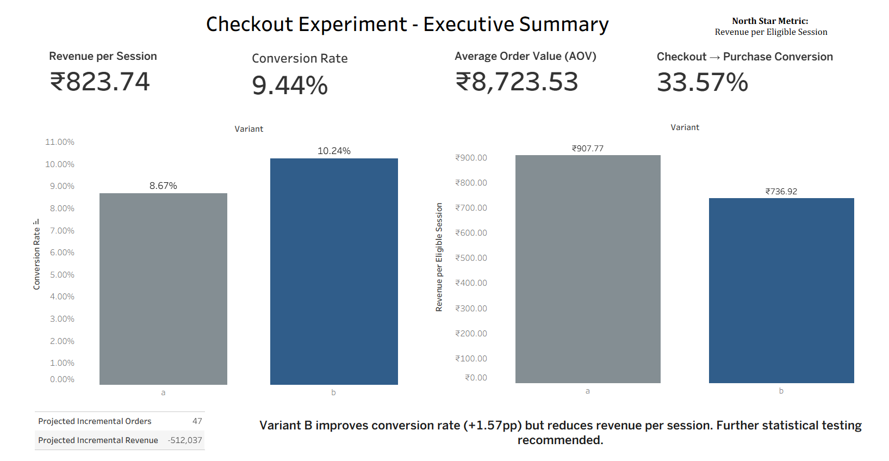

# 📊 Checkout Experiment & Growth Analytics System 

> 🚀 End-to-end product analytics project simulating real-world A/B experimentation and growth decision-making.

This repository contains the **complete workflow** — including raw data, ETL pipeline, analysis, dashboards, and final business recommendations.

---
## 🛠 Tech Stack

- Python (pandas, numpy, matplotlib, statsmodels)
- Tableau (Dashboarding)
- Jupyter Notebook (Analysis)
- SQL-style data modeling (fact/dimension tables)

## 📸 Dashboard Preview

> Executive Summary and Experiment Insights



## 🚀 Overview

This project analyzes the impact of a redesigned checkout experience (**Variant B**) on user behavior and revenue outcomes.

The goal is to answer:

> Should the new checkout experience be rolled out?

To solve this, the project implements a full analytics pipeline:

- Data ingestion & transformation (ETL)
- Funnel and drop-off analysis
- A/B experiment evaluation
- Segment-level insights (HTE-lite)
- Weekly KPI trend analysis
- Business impact estimation
- Interactive dashboards
- Executive decision memo

---
## 🎯 Business Problem

A new checkout design (Variant B) was introduced to improve user conversion.

However, improving conversion alone is not sufficient —  
the goal is to maximize **revenue per session** while maintaining user experience.

This project evaluates whether Variant B should be rolled out based on:
- Conversion impact
- Revenue trade-offs
- Statistical significance
- Segment-level performance

## 🧠 Key Insights

- Conversion rate increased under Variant B (**+1.57pp / +18.2% lift**)
- Revenue per session decreased → **monetization issue**
- Results are **not statistically significant**
- Strongest gains seen in:
  - Premium users
  - Search channel
  - Tier 2 cities
- Largest drop-off occurs at:
  - **Product View → Add to Cart (~20%)**

📌 **Conclusion:**  
Variant B improves conversion but introduces revenue risk → rollout not recommended yet.

---

## 📂 Project Structure

```bash
project/
│
├── raw_data/ # Original input datasets
│
├── etl/
│ └── etl_pipeline.py # Builds cleaned datasets
│
├── data/ # Processed datasets (used in analysis)
│ ├── fact_sessions.csv
│ ├── fact_orders.csv
│ └── dim_users_enriched.csv
│
├── analysis/
│ └── analysis.ipynb # Full analytics workflow
│
├── dashboard/
│ ├── checkout_experiment_dashboard.twbx
│ └── dashboard_screenshots/
│
├── final_story/
│ └── final_memo.pdf # Business recommendation
│
├── requirements.txt
│
└── README.md
```
---

## ⚠️ Important Notes

### 🔹 raw_data/
- Contains original datasets
- Used only for ETL
- Not required to run analysis if `/data/` already exists

### 🔹 data/
- Contains final curated datasets
- All analysis depends on this folder

### 🔹 requirements.txt
- Contains all Python dependencies required to run the project

---

## ⚙️ Requirements

- Python 3.9+
- pandas
- numpy
- matplotlib
- statsmodels
- Tableau Desktop (for dashboard)

## ⚙️ Setup

Install dependencies:

```bash
pip install -r requirements.txt
```

## 🔄 How to Run the Project

### Option 1 — Full Pipeline

Step 1: Run ETL
```bash
cd etl
python etl_pipeline.py
```

Then open:

```bash
analysis/analysis.ipynb
```

Run all cells to reproduce:

Funnel analysis
KPI trends
A/B testing
Segment insights
Business impact


### Option 2 — Skip ETL (Quick Run)

If /data/ already exists:

Open notebook directly
Run all cells to reproduce:

- Funnel analysis  
- KPI trends  
- A/B testing  
- Segment insights  
- Business impact  

## 📊 Dashboard

Open in Tableau:

```bash
dashboard/checkout_experiment_dashboard.twbx
```


### Views Included:

- Executive Summary  
- Funnel Analysis  
- Segment Explorer  
- A/B Statistical Review  

---

## 📈 Analytical Coverage

### 🔹 Funnel Analysis
- Step conversion rates  
- Drop-off identification  
- Time-to-step analysis  

### 🔹 A/B Testing
- Conversion lift  
- Revenue impact  
- Z-test for significance  
- Confidence intervals  

### 🔹 Weekly KPI Trends
- Conversion rate  
- Revenue per session  
- Average Order Value (AOV)  

### 🔹 Segment Analysis
- Channel performance  
- User segments  
- City tiers  
- New vs returning users  

### 🔹 Business Impact
- Incremental orders  
- Revenue projections  
- Scenario modeling  

---

## 🧾 Final Recommendation

- Do **not** roll out Variant B yet  
- Extend experiment duration  
- Improve monetization strategy before scaling  

---

## 💡 Key Takeaways

- Conversion improvement ≠ business success  
- Revenue per session is a critical metric  
- Funnel bottlenecks often occur before checkout  
- Segment-level insights drive better decisions  
- Statistical validation is essential  

---
## 🔁 Reproducibility

- Run ETL to regenerate datasets OR
- Use pre-built datasets in `/data/`
- Run notebook end-to-end
- Open Tableau dashboard for visualization

## 📌 Why This Project Matters
This project demonstrates:

- End-to-end analytics workflow  
- Strong business interpretation of data  
- Experimentation and statistical reasoning  
- Practical product analytics skills  

---
## 📢 Impact

This project simulates real-world product analytics workflows and demonstrates:

- Data engineering (ETL pipelines)
- Product analytics thinking
- Experimentation design
- Statistical decision-making
- Business-focused storytelling

Suitable for roles in:
- Product Analytics
- Data Science
- Growth Analytics

 ## ⚠️ Repository Note

The virtual environment (`venv/`) is excluded as per best practices.
Dependencies are managed via `requirements.txt`.


